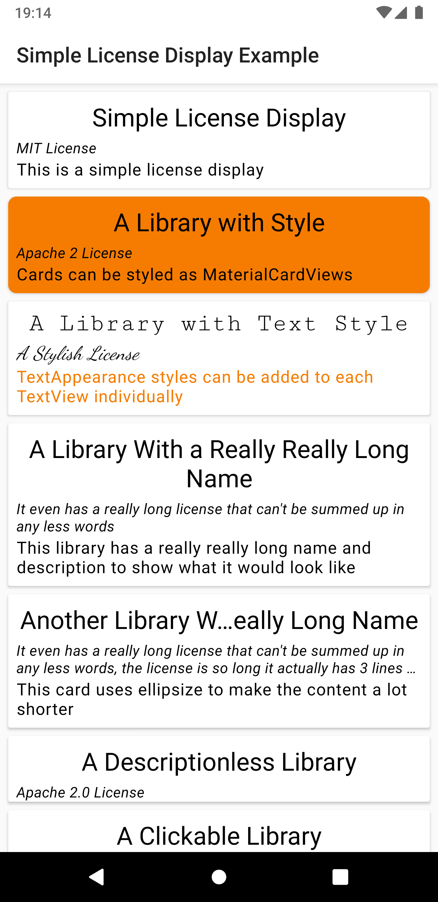

# Simple License Display
[](https://jitpack.io/#marcdonald/simplelicensedisplay)


A very simple card view for displaying open source library license information



## How to Use
### Styling
The view is based on the [MaterialCardView](https://material.io/develop/android/components/material-card-view/) and can be styled the same way. 

### Attributes
* `sldTitle` - Title of the card, typically the name of the library 
  * `sldTitleMaxLines` - Max lines the title can span 
  * `sldTitleEllipsize` - Style of the ellipsize (either `end` or `middle` leaving it unset will show no ellipsize)
  * `sldTitleTextAppearance` - TextAppearance Style to apply to the title TextView
* `sldDescription` - Description section, typically a brief description of where and why the library is used 
  * `sldDescriptionMaxLines` - Max lines the description can span 
  * `sldDescriptionEllipsize` - Style of the ellipsize (either `end` or `middle` leaving it unset will show no ellipsize)
  * `sldDescriptionTextAppearance` - TextAppearance Style to apply to the description TextView
* `sldLicense` - License section, put the shortened name of the license used here (e.g. MIT License, Apache 2.0 License etc...)
  * `sldLicenseMaxLines` - Max lines the license can span 
  * `sldLicenseEllipsize` - Style of the ellipsize (either `end` or `middle` leaving it unset will show no ellipsize)
  * `sldLicenseTextAppearance` - TextAppearance Style to apply to the license TextView

### Example
```xml
<com.marcdonald.simplelicensedisplay.SimpleLicenseDisplay
  android:layout_width="match_parent"
  android:layout_height="wrap_content"
  app:sldTitle="Simple License Display"
  app:sldDescription="This is a simple license display"
  app:sldLicense="MIT License" />
```

For more information see the example project.

## Download and Use in Your App
[](https://jitpack.io/#com.marcdonald/simplelicensedisplay)

`implementation 'com.marcdonald:simplelicensedisplay:RELEASE-NUMBER'`

Ensure the Jitpack repository is included in your root build.gradle like so
```
allprojects {
  repositories {
    ...
    maven { url 'https://jitpack.io' }
  }
}
```

## License
```
The MIT License (MIT)

Copyright (c) 2020 Marc Donald

Permission is hereby granted, free of charge, to any person obtaining a copy of
this software and associated documentation files (the "Software"), to deal in
the Software without restriction, including without limitation the rights to
use, copy, modify, merge, publish, distribute, sublicense, and/or sell copies of
the Software, and to permit persons to whom the Software is furnished to do so,
subject to the following conditions:

The above copyright notice and this permission notice shall be included in all
copies or substantial portions of the Software.

THE SOFTWARE IS PROVIDED "AS IS", WITHOUT WARRANTY OF ANY KIND, EXPRESS OR
IMPLIED, INCLUDING BUT NOT LIMITED TO THE WARRANTIES OF MERCHANTABILITY, FITNESS
FOR A PARTICULAR PURPOSE AND NONINFRINGEMENT. IN NO EVENT SHALL THE AUTHORS OR
COPYRIGHT HOLDERS BE LIABLE FOR ANY CLAIM, DAMAGES OR OTHER LIABILITY, WHETHER
IN AN ACTION OF CONTRACT, TORT OR OTHERWISE, ARISING FROM, OUT OF OR IN
CONNECTION WITH THE SOFTWARE OR THE USE OR OTHER DEALINGS IN THE SOFTWARE.
```
